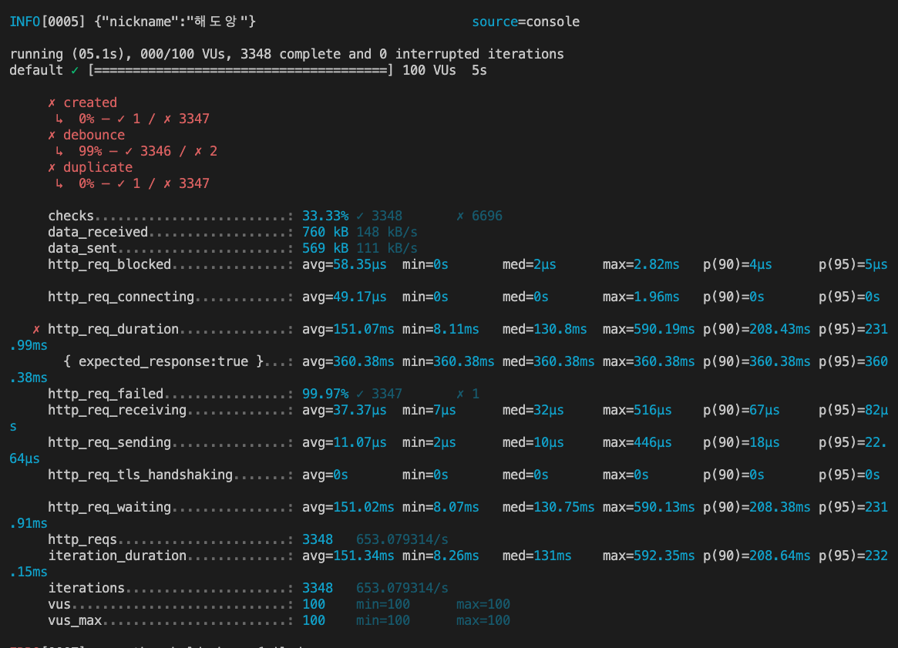

## 네임드 락을 이용한 동시성 제어 

### 네임드 락이란 ? 
- MySQL은 특정 키워드를 잠금할 수 있는 기능을 지원한다
- 클라이언트 상호 동기화 처리 시 유용하다
  - GET_LOCK('문자열', timeout) : 특정 문자열을 잠글 수 있다
    - timeout은 해당 문자열이 잠겨 있는 경우 타임아웃을 설정할 수 있다 
    - return : 1 잠금 성공 0 timeout 
  - IS_FREE_LOCK('문자열') : 해당 문자열이 잠금 상태인지 조회할 수 있다
    - return : 1 잠금 상태가 아님 0 잠금 
  - RELEASE_LOCK('문자열') : 해당 문자열 잠금을 해제한다
    - return : 1 잠금 해제 성공 0 잠금 해제 실패(GET_LOCK 세션이 아닌 경우 또는 해당 문자열이 잠금 상태가 아닌 경우)

### 테스트 목적
- 네임드 락으로 중복 요청 처리하기
- 사용중인 락이 있는 경우 403 예외를 반환한다 
- 중복된 닉네임이 존재하는 경우 400 예외를 반환한다

### 테스트 결과 
- 

### 참고
- [https://nextjs-notion-starter-798d1ulmf-haedoang.vercel.app/5](https://nextjs-notion-starter-798d1ulmf-haedoang.vercel.app/5)
- [https://dev.mysql.com/doc/refman/5.7/en/locking-functions.html](https://dev.mysql.com/doc/refman/5.7/en/locking-functions.html)